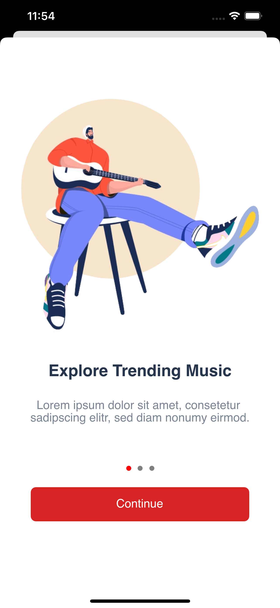
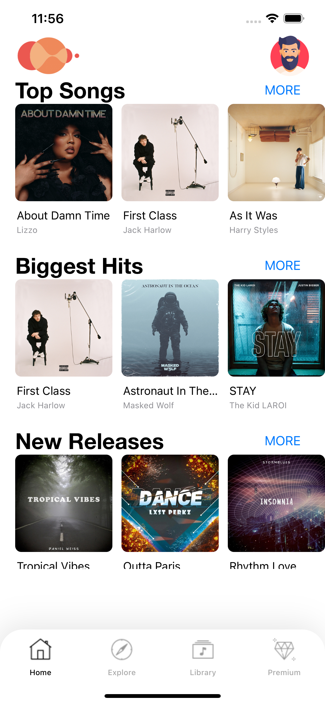

# Rhythm – music app

<!--  -->

# Final iOS Project
By: Vrushank Amin & Parth Antala

# Introduction:

For our final project of iOS app development\, we have build a music app named  __Rhythm\.__

We used storyboard and Swift to develop this application and for designing we build our wireframes in AdobeXD and exported using Zeplin\.

We have build this App using Napster API for tracks and all metadata about song and playlists like top songs\, albums\, greatest hits\, new releases etc\.

Napster Documentation:

https://developer\.prod\.napster\.com/api/v2\.2

# Authentication:

* In Rhythm\, we are giving users 3 choices for sign in or register\.
* Facebook Login
* Firebase Authentication
* Google Sign in

# Sign up:

For sign up\, we have implemented firebase sign up method\, user can sign up by email and password

# Guides

After logging in\, user will see the 3 guide screens which was built using Guide View Controller

# Comments:

In comments screen\, user can comment about that song and see others comments as well\, we are using firebase realtime database for storing comments\.

# Home Screen:

After continuing guide screens\, user will go to home screen which is attached with tab bar controller with all other screens\.

In home screen\, Top songs\, biggest hits and new releases\. User can press more and see the list of songs accordingly\.

# Now Playing:

In Now playing screen\, user will see the nice animated album art and options for shuffle\, next song\, previous song\, play\-pause\, and Comments button\.

# Explore Screen:

In explore screen user will see collection of genres and new albums and releases\.

# Premium Subscription:

We are providing users premium version option to subscribe Rhythm Yearly or monthly\.

# Challenges:

The most biggest challenge was to figure out how we can implement Napster’s API and how we can play the tracks\.

We also had to learn how google\, facebook and firebase authentication works and how we can store data into firebase

For player\, we had to learn how we can implement the player track seeker\.

For Comments\, challenge was to store the comments for a particular song in firebase\.

# Next Steps:

In next step\, we can implement download track feature and share songs with others\.

In comment screen user can see other users profile\.

User can see the lyrics in now playing screen

User can make favorites and share with others\.

# Thank you!

